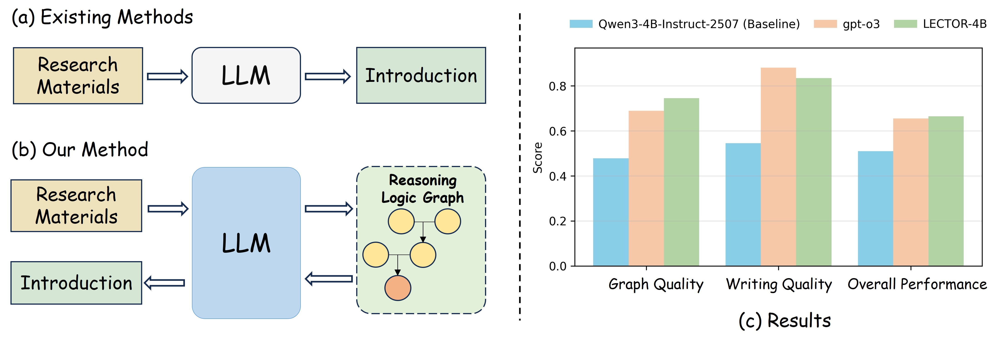
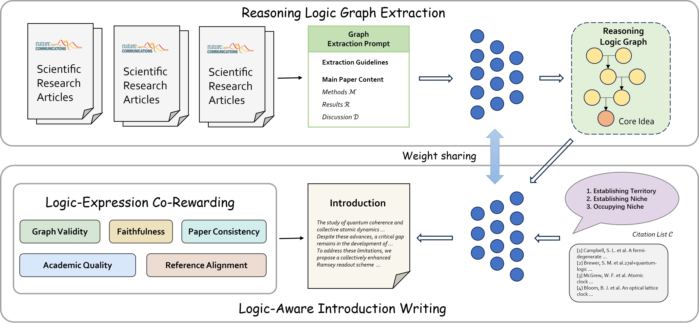

# LECTOR: Joint Optimization of Scientific Reasoning Graphs and Introduction Generation

[](https://arxiv.org/abs/2605.25964)
[](LICENSE)

This repository contains the official implementation of **LECTOR**, a framework that jointly optimizes reasoning logic graph extraction and scientific introduction writing through co-reinforcement learning.

## News

- **2026.05.26**: Code released.
- **2026.05.01**: LECTOR accepted to ICML 2026.

## Overview

<p align="center">
  
</p>

Existing methods treat introduction writing as a direct text generation task, often leading to logical inconsistencies and hallucinations. LECTOR reformulates the task as **Content-Conditional Introduction Generation (CCIG)**, first extracting a Reasoning Logic Graph as a verifiable logical blueprint to guide logic-aware writing. LECTOR-4B significantly outperforms the Qwen3-4B baseline and achieves superior Overall Performance compared to the commercial closed-source model GPT-o3.

## Framework

<p align="center">
  
</p>

The framework operates in two synergistic stages within a single rollout:

- **Reasoning Logic Graph Extraction**: Given the main body of scientific research articles (Methods, Results, Discussion — excluding the Introduction), LECTOR extracts an explicit Reasoning Logic Graph. This graph consists of nodes connected through deduction, abduction, and induction to derive the paper's core idea.
- **Logic-Aware Introduction Writing**: Taking the extracted graph and a citation list as input, the model generates a structured introduction following the CARS (Create a Research Space) move structures.
- **Optimization**: Both stages share weights and are jointly optimized through a Logic-Expression Co-Rewarding mechanism, evaluating Graph Quality, Graph-Writing Alignment, Writing Quality, and Citation Quality.

## Installation

```bash
pip install -e .
```

### Dependencies

Key dependencies:
- PyTorch >= 2.0
- Transformers
- Ray >= 2.41.0
- vLLM >= 0.7.3
- sentence-transformers
- pydot
- yake
- nltk

See `requirements.txt` for the full list.

## Data Preparation

### 1. Download Dataset

Download the NC_Physics dataset and place it in `./data/`:
<!-- TODO: Add dataset download link -->

```
data/
├── NC_Physics_train.jsonl
└── NC_Physics_test.jsonl
```

### 2. Preprocess Data

```bash
python data_preprocess/NC_Physics.py \
    --local_dir ./data/ \
    --name LECTOR \
    --train_size 10000 \
    --val_size 100
```

This generates `data/LECTOR_train.parquet` and `data/LECTOR_val.parquet`.

## Training

### Environment Variables

Set the LLM judge endpoint for reward computation:
```bash
export LLM_JUDGE_API_KEY="your-api-key"
export LLM_JUDGE_BASE_URL="http://your-llm-server/v1/chat/completions"
```

### Run Training

```bash
bash scripts/run_training.sh
```

Key configurable parameters in `scripts/run_training.sh`:
- `BASE_MODEL`: Path to base model (default: `Qwen/Qwen3-4B-Instruct`)
- `TRAIN_BATCH_SIZE`: Training batch size (default: 64)
- `N_GPUS`: Number of GPUs (default: 4)
- `ACTOR_LR`: Actor learning rate (default: 1e-6)

## Evaluation

### 1. Start Model Server

Deploy your trained model using vLLM:
```bash
python -m vllm.entrypoints.openai.api_server \
    --model /path/to/checkpoint \
    --port 8000
```

### 2. Run Evaluation

```bash
bash scripts/run_evaluation.sh \
    --model /path/to/checkpoint \
    --base_url http://127.0.0.1:8000/v1 \
    --data_file ./data/NC_Physics_test.jsonl
```

## Project Structure

```
LECTOR/
├── verl/                      # RL training framework
│   ├── trainer/               # PPO trainer and algorithms
│   ├── workers/               # Distributed workers
│   └── models/                # Model support
├── agent_system/              # Multi-turn agent framework (from verl-agent), with LECTOR environment and rewards
│   ├── environments/
│   │   ├── env_manager.py     # PaperEnvironmentManager (two-step env)
│   │   ├── graph_reward.py    # Graph quality evaluation
│   │   ├── writing_reward.py  # Writing quality metrics
│   │   └── writing_reward_llm.py  # LLM-as-judge evaluation
│   ├── multi_turn_rollout/    # Multi-turn trajectory collection
│   └── memory/                # Memory module
├── data_preprocess/           # Data preparation scripts
├── evaluation/                # Evaluation pipeline
└── scripts/                   # Training & evaluation scripts
```

## Citation

```bibtex
@misc{xiao2026lector,
      title={LECTOR: Joint Optimization of Scientific Reasoning Graphs and Introduction Generation}, 
      author={Jiabei Xiao and Yizhou Wang and Chen Tang and Pengze Li and Wanli Ouyang and Shixiang Tang},
      year={2026},
      eprint={2605.25964},
      archivePrefix={arXiv},
      primaryClass={cs.AI},
      url={https://arxiv.org/abs/2605.25964}, 
}
```

## Acknowledgement

This codebase is built upon [verl-agent](https://github.com/langfengQ/verl-agent). We thank the authors for their excellent open-source multi-turn RL agent training framework.

## License

This project is licensed under the Apache License 2.0 - see the [LICENSE](LICENSE) file for details.
